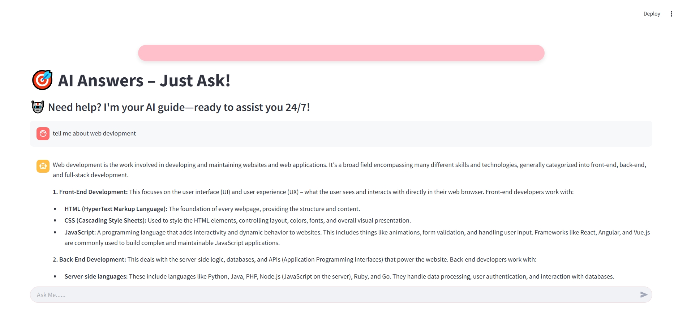

# 🧠AI Answers – Just Ask! 💬  

ChatSphere is an AI-powered chatbot built using **Streamlit** and **Google Gemini API**. It provides intelligent and context-aware conversations with users, offering fast and efficient responses.  




## 🛠️ Technologies Used  
- Python 🐍  
- Streamlit 🖥️  
- Google Gemini API 🤖  
- JSON for configuration storage  

## 📌 Installation & Setup  

### **1️⃣ Clone the Repository**  
```bash
[git clone https://github.com/abineshg89/chatgpt_gemini.git]
cd chatgpt_gemini
